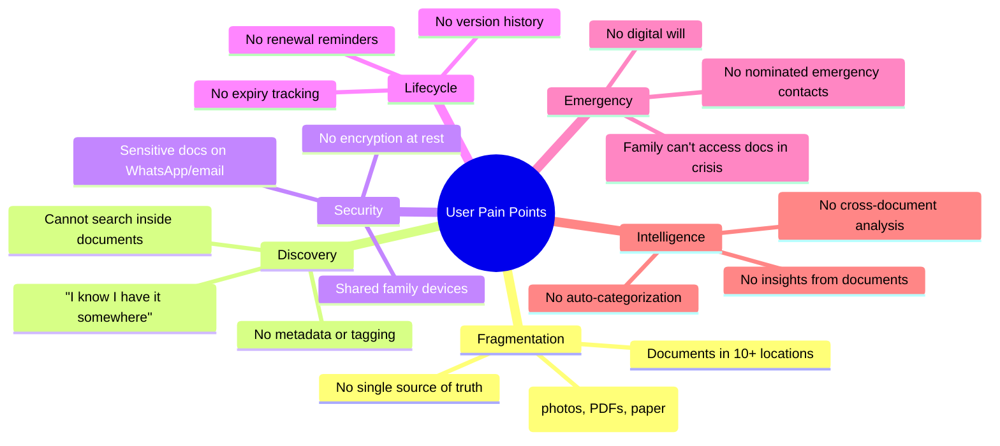
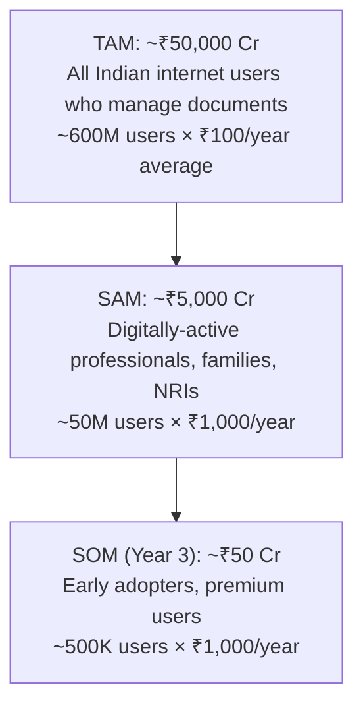
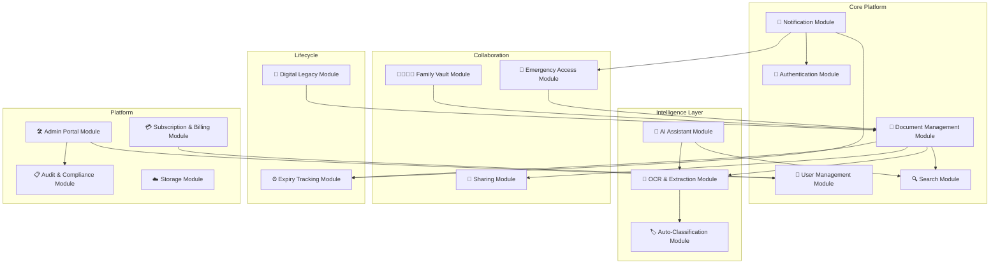
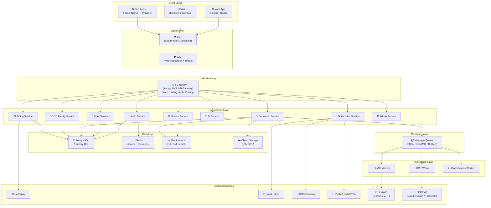
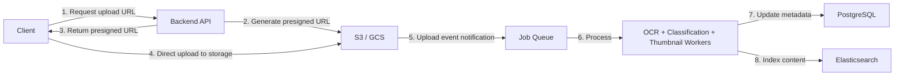
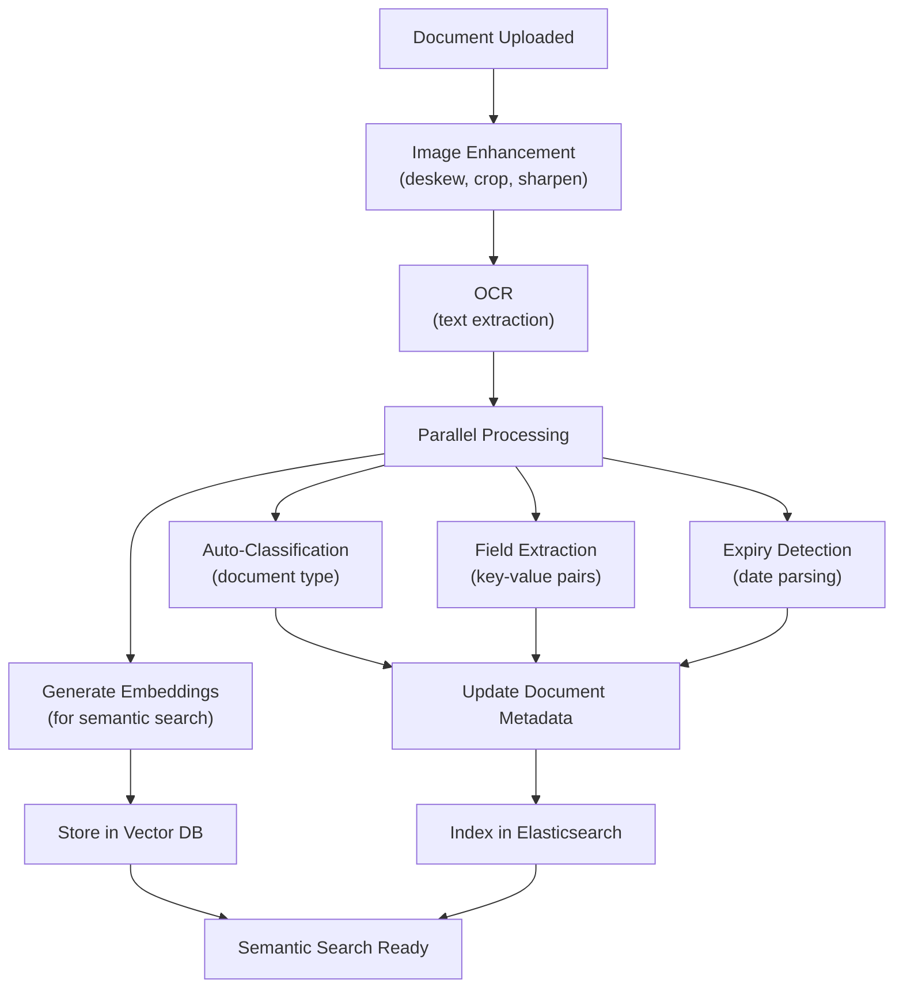
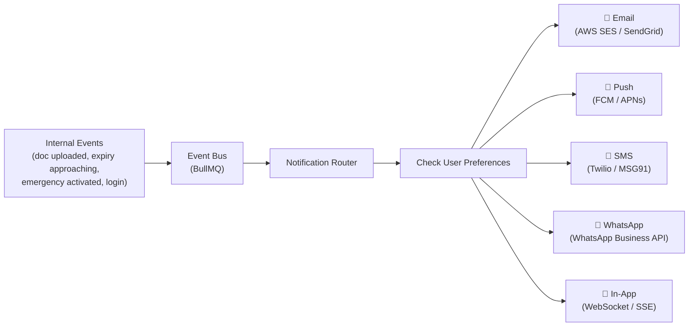

# LifeLedger — Software Requirements Specification & Product Planning Document

> **Version:** 1.0  
> **Date:** June 4, 2026  
> **Classification:** Confidential — Internal Strategy  
> **Prepared by:** System Architect & Product Lead

---

## Table of Contents

1. [Problem Analysis](#1-problem-analysis)
2. [Product Vision](#2-product-vision)
3. [Market Analysis](#3-market-analysis)
4. [User Personas](#4-user-personas)
5. [Functional Requirements](#5-functional-requirements)
6. [Non-Functional Requirements](#6-non-functional-requirements)
7. [System Modules](#7-system-modules)
8. [Feature Roadmap](#8-feature-roadmap)
9. [High-Level System Architecture](#9-high-level-system-architecture)
10. [Database Planning](#10-database-planning)

---

# 1. Problem Analysis

## 1.1 What Real-World Problems Does LifeLedger Solve?

| #   | Problem                                                                                                                                                                                                                             | Impact                                                                                                                       |
| --- | ----------------------------------------------------------------------------------------------------------------------------------------------------------------------------------------------------------------------------------- | ---------------------------------------------------------------------------------------------------------------------------- |
| 1   | **Document Fragmentation** — Critical life documents are scattered across physical folders, email attachments, WhatsApp chats, Google Drive, phone galleries, and filing cabinets.                                                  | Users cannot locate documents when urgently needed (hospital visits, visa applications, loan approvals).                     |
| 2   | **No Unified Life Record System** — There is no single platform designed to hold _all_ categories of life records (identity, medical, legal, financial, educational).                                                               | People manage 50-200+ important documents with zero organizational infrastructure.                                           |
| 3   | **Emergency Unpreparedness** — When a medical emergency, accident, or death occurs, family members have no centralized way to access the victim's insurance details, medical history, bank accounts, or legal directives.           | Families face weeks-to-months of chaos recovering information. Insurance claims lapse. Legal disputes arise.                 |
| 4   | **Digital Legacy Void** — When a person dies, their digital accounts, subscriptions, crypto wallets, and online assets become inaccessible. No mainstream tool exists for structured digital inheritance planning.                  | Billions in digital assets are permanently lost annually.                                                                    |
| 5   | **Document Expiry Blindness** — People forget renewal dates for passports, insurance policies, vehicle registrations, domain names, and subscriptions.                                                                              | Expired documents cause legal issues, coverage gaps, and financial penalties.                                                |
| 6   | **Inaccessible Medical History** — Patients carry fragmented medical records across multiple hospitals and clinics with no portable, searchable medical history.                                                                    | Misdiagnosis, redundant tests, dangerous drug interactions, and delayed treatments.                                          |
| 7   | **Family Document Coordination Failure** — Families (especially with elderly parents and young children) struggle to manage documents across members.                                                                               | A parent's Aadhaar, a child's birth certificate, a spouse's insurance — all in different places managed by different people. |
| 8   | **Search & Retrieval Friction** — Even when documents are stored digitally, finding a specific clause in a policy document, a vaccination date, or a property registration number requires manual browsing through dozens of files. | Hours wasted on retrieval; critical information missed.                                                                      |

## 1.2 Who Are the Target Users?

### Primary Segments

| Segment                       | Age Range | Key Need                                                                            | Market Size (India) |
| ----------------------------- | --------- | ----------------------------------------------------------------------------------- | ------------------- |
| **Students**                  | 16–25     | Academic certificates, ID proofs, admission documents                               | ~300M               |
| **Working Professionals**     | 25–55     | Career docs, tax records, insurance, investments                                    | ~500M               |
| **Families**                  | 28–60     | Multi-member document management, children's records, elderly parent docs           | ~250M households    |
| **Senior Citizens**           | 55+       | Medical records, pension, legacy planning, emergency access                         | ~140M               |
| **NRIs / Expats**             | 25–55     | Cross-country document management, visa tracking, remote access to Indian documents | ~32M                |
| **Freelancers & Gig Workers** | 20–40     | Contracts, invoices, certifications, insurance (no employer-managed benefits)       | ~15M                |

### Secondary Segments (Future)

- Small businesses (employee document management)
- Legal professionals (client document vaults)
- Healthcare providers (patient record portals)
- Financial advisors (client portfolio management)

## 1.3 Pain Points That Exist Today



## 1.4 How Is LifeLedger Different?

| Capability                    | Google Drive / Dropbox / OneDrive             | DigiLocker                        | LifeLedger                                                                                     |
| ----------------------------- | --------------------------------------------- | --------------------------------- | ---------------------------------------------------------------------------------------------- |
| **Purpose**                   | General-purpose file storage                  | Government-issued document locker | Purpose-built life record management                                                           |
| **Document Categories**       | None — flat folders                           | Limited to govt-issued docs       | 11+ life categories with structured metadata                                                   |
| **AI Search**                 | Basic filename search                         | No search                         | Full-text OCR + semantic AI search across all documents                                        |
| **Expiry Tracking**           | ❌                                            | ❌                                | ✅ Auto-detected from document + manual override                                               |
| **Emergency Access**          | ❌                                            | ❌                                | ✅ Nominated contacts with time-locked access                                                  |
| **Family Vault**              | Shared folders (no roles)                     | Single user only                  | ✅ Multi-member vault with role-based access                                                   |
| **Digital Legacy**            | ❌ (Google Inactive Account Manager is basic) | ❌                                | ✅ Full digital will, asset inventory, nominee management                                      |
| **AI Assistant**              | ❌                                            | ❌                                | ✅ "When does my passport expire?", "Show my blood type", "List all active insurance policies" |
| **Medical Timeline**          | ❌                                            | ❌                                | ✅ Chronological health history with AI summaries                                              |
| **Smart Notifications**       | ❌                                            | ❌                                | ✅ Context-aware reminders (renewals, deadlines, reviews)                                      |
| **OCR & Auto-Categorization** | ❌                                            | ❌                                | ✅ Upload → OCR → Auto-tag → Auto-categorize                                                   |
| **Document Intelligence**     | ❌                                            | ❌                                | ✅ Extract key fields (policy numbers, dates, amounts) automatically                           |
| **Offline Access**            | Limited                                       | ❌                                | ✅ Encrypted offline cache for critical documents                                              |
| **Data Sovereignty**          | US/EU servers                                 | Indian govt servers               | User-chosen region (India-first, with global options)                                          |

> [!IMPORTANT]
> **LifeLedger's moat is not storage — it's intelligence, lifecycle management, and emergency preparedness built on top of storage.** No existing solution treats documents as living, interconnected life records with expiry dates, relationships, and AI-extractable meaning.

---

# 2. Product Vision

## 2.1 Mission Statement

> **To empower every individual and family to securely organize, protect, and intelligently manage their entire life's important records — so that no critical document is ever lost, expired, or inaccessible when it matters most.**

## 2.2 Vision Statement

> **To become the world's most trusted Digital Life Operating System — the single platform where people store, manage, search, share, and inherit all life records across identity, health, education, career, finance, legal, and family domains.**

## 2.3 Core Value Proposition

```
┌─────────────────────────────────────────────────────────────────┐
│                    LifeLedger Value Stack                        │
├─────────────────────────────────────────────────────────────────┤
│  Layer 4:  INTELLIGENCE    — AI search, insights, predictions   │
│  Layer 3:  LIFECYCLE       — Expiry tracking, renewals, alerts  │
│  Layer 2:  ORGANIZATION    — Categories, tags, metadata, OCR    │
│  Layer 1:  SECURITY        — Encryption, access control, vault  │
│  Layer 0:  STORAGE         — Secure, cloud-native, multi-format │
└─────────────────────────────────────────────────────────────────┘
```

**One-liner:** _"Your entire life, securely organized, intelligently managed, always accessible."_

## 2.4 Unique Selling Points (USP)

| #   | USP                            | Description                                                                                                                                        |
| --- | ------------------------------ | -------------------------------------------------------------------------------------------------------------------------------------------------- |
| 1   | **Life-Centric Organization**  | Not folders and files — but _life categories_ (Identity, Health, Career, Finance, etc.) with purpose-built metadata schemas for each.              |
| 2   | **AI Document Intelligence**   | Upload any document → automatic OCR → field extraction → categorization → expiry detection. Zero manual data entry.                                |
| 3   | **Natural Language Search**    | Ask "What's my blood group?", "Show insurance policies expiring this year", "When was my last eye checkup?" — get instant answers.                 |
| 4   | **Emergency Access Protocol**  | Designate trusted contacts who gain time-locked, audited access to critical documents during medical emergencies or death.                         |
| 5   | **Digital Legacy Vault**       | Create a structured digital will: nominate heirs for digital assets, write directives, assign access levels that activate on verified life events. |
| 6   | **Family Vault**               | One family, one vault. Parents manage children's documents. Children manage elderly parents' records. Role-based access for every member.          |
| 7   | **Smart Lifecycle Management** | Every document has a lifecycle. LifeLedger tracks validity periods, sends renewal reminders, and flags expired or soon-to-expire records.          |
| 8   | **Privacy-First Architecture** | End-to-end encryption, zero-knowledge options, user-controlled data sovereignty, and full GDPR/DPDP Act compliance.                                |

---

# 3. Market Analysis

## 3.1 Competitor Analysis

### Direct Competitors

| Competitor                  | Category                | Strengths                              | Weaknesses                                                       | Threat Level |
| --------------------------- | ----------------------- | -------------------------------------- | ---------------------------------------------------------------- | ------------ |
| **DigiLocker** (India Govt) | Govt document locker    | Free, govt integration, Aadhaar-linked | Limited to govt docs, no AI, no family vault, no legacy, poor UX | Medium       |
| **Docsumo**                 | Document AI platform    | Strong OCR/extraction                  | B2B focused, not consumer life management                        | Low          |
| **Everplans** (US)          | Digital estate planning | Legacy/estate planning focus           | US-only, no document management, no AI, expensive                | Low          |
| **Cake** (US)               | End-of-life planning    | Good UX for will/legacy                | Very narrow scope — only end-of-life                             | Low          |
| **Joincake**                | Digital legacy          | Free, covers digital accounts          | No document storage, no AI, limited scope                        | Low          |

### Indirect Competitors

| Competitor                            | Category                   | Overlap with LifeLedger                                                                           |
| ------------------------------------- | -------------------------- | ------------------------------------------------------------------------------------------------- |
| **Google Drive / Dropbox / OneDrive** | General cloud storage      | Users currently misuse these for document storage — but they offer zero life-management features. |
| **Apple Health / Google Health**      | Health records             | Medical records only; no other life categories.                                                   |
| **1Password / Bitwarden**             | Password/secret management | Credential storage only; not documents.                                                           |
| **Notion / Evernote**                 | Note-taking / organization | Manual organization; no OCR, no document intelligence, no security-grade encryption.              |
| **PHR Apps (ABHA-linked)**            | Personal Health Records    | Health records only; India-specific; fragmented ecosystem.                                        |

## 3.2 Gaps in the Market

| Gap                                        | Description                                                                                                                                                                                 |
| ------------------------------------------ | ------------------------------------------------------------------------------------------------------------------------------------------------------------------------------------------- |
| **No Unified Life Platform**               | Every tool solves one slice (health, legacy, storage, passwords). Nobody owns the "full life record" category.                                                                              |
| **Consumer Document AI is Non-Existent**   | OCR and document extraction exist in B2B (banking, insurance). No consumer product applies this to personal documents.                                                                      |
| **Emergency Preparedness is Afterthought** | No mainstream app lets you set up "if I'm in an accident, my spouse can access these documents."                                                                                            |
| **Family-as-a-Unit is Ignored**            | Cloud storage treats every person as an isolated user. Families share documents constantly, but have no tools designed for this.                                                            |
| **India-Specific Need is Underserved**     | India has unique document types (Aadhaar, PAN, RC, etc.), unique family structures (joint families), and unique regulatory requirements (DPDP Act). No India-first startup owns this space. |
| **Document Lifecycle is Unmanaged**        | No consumer tool tracks that your passport expires in 6 months, your car insurance renews next week, or your health checkup is overdue.                                                     |

## 3.3 Opportunities

| Opportunity                        | Rationale                                                                                                                                           |
| ---------------------------------- | --------------------------------------------------------------------------------------------------------------------------------------------------- |
| **India's Digital Transformation** | 800M+ internet users, Digital India push, UPI success — population ready for digital document management.                                           |
| **Regulatory Tailwinds**           | DPDP Act (2023) creates awareness about data rights; ABHA (health) and DigiLocker (govt) normalize digital document storage.                        |
| **Category Creation**              | "Digital Life Management" doesn't exist as a product category. First-mover advantage is massive.                                                    |
| **Premium Willingness**            | Users pay for password managers, VPNs, cloud storage. A premium document vault with AI is a natural extension.                                      |
| **B2B2C Expansion**                | Employers, hospitals, banks, and insurers could provision LifeLedger for their users (employee doc management, patient portals, etc.).              |
| **API Platform Play**              | Become the "document identity layer" — other apps (loan apps, insurance apps) can request verified documents from a user's LifeLedger with consent. |

## 3.4 TAM / SAM / SOM Estimation (India Focus)



---

# 4. User Personas

## 4.1 Persona 1: Ananya — The Student

| Attribute          | Detail                                        |
| ------------------ | --------------------------------------------- |
| **Name**           | Ananya Sharma                                 |
| **Age**            | 21                                            |
| **Location**       | Pune, India                                   |
| **Occupation**     | Final-year B.Tech student                     |
| **Tech Savviness** | High — digital native, uses 15+ apps daily    |
| **Devices**        | Android phone (primary), shared family laptop |

**Documents She Manages:**

- 10th & 12th marksheets, degree certificates
- Aadhaar, PAN card, Passport
- College ID, bonafide certificates
- Internship offer letters, certificates
- Scholarship documents
- Medical fitness certificates

**Pain Points:**

1. "I screenshot my Aadhaar and keep it on WhatsApp — I know it's not safe, but it's convenient."
2. "I needed my 10th marksheet for a form and spent 2 hours asking my mom to find the physical copy and photograph it."
3. "I have 6 internship certificates scattered across emails. I can never find them when updating my resume."
4. "I'm applying for a master's abroad — tracking passport validity, test scores, transcripts, and recommendation letters across 10 universities is chaos."

**What She Wants from LifeLedger:**

- One place for ALL her academic + identity documents
- Quick share feature (generate a link for a certificate)
- Expiry tracking for passport and test scores (GRE valid for 5 years)
- Resume-ready export of certificates
- Free or student-priced tier

**Success Metric:** "I can find any document in under 10 seconds."

---

## 4.2 Persona 2: Rahul — The Working Professional

| Attribute          | Detail                                |
| ------------------ | ------------------------------------- |
| **Name**           | Rahul Mehta                           |
| **Age**            | 34                                    |
| **Location**       | Bangalore, India                      |
| **Occupation**     | Senior Software Engineer at a startup |
| **Income**         | ₹25 LPA                               |
| **Tech Savviness** | Very high                             |
| **Devices**        | iPhone, MacBook, iPad                 |

**Documents He Manages:**

- Aadhaar, PAN, Passport, Driving License
- 4 insurance policies (health, term, vehicle, home)
- Tax documents (Form 16, ITR acknowledgements — 8 years)
- Investment records (MF statements, FD receipts, stock holding)
- Property documents (flat purchase agreement, registration)
- Employment contracts, appraisal letters
- Health records (annual checkup reports, prescriptions)

**Pain Points:**

1. "I have 4 insurance policies and genuinely don't remember what each covers or when they renew."
2. "Every tax season, I spend a full weekend collecting Form 16, HRA receipts, and investment proofs from different sources."
3. "My wife and I bought a flat. The registry documents are with the lawyer, the bank has some copies, and we have some. Nobody has the complete set."
4. "If something happens to me, my wife would have no idea where to find our insurance details, investment account numbers, or property papers."

**What He Wants from LifeLedger:**

- AI-powered dashboard showing all active policies, investments, and their statuses
- Tax season helper — all tax-relevant documents auto-grouped
- Family vault shared with spouse
- Emergency access for spouse with clear instructions
- "Ask anything" AI search ("What's my health insurance claim limit?")

**Success Metric:** "Tax filing goes from a weekend to 30 minutes. My wife can access everything if I'm not around."

**Willingness to Pay:** ₹999–₹2,499/year (comparable to a password manager or cloud storage)

---

## 4.3 Persona 3: Priya & Vikram — The Family Users

| Attribute          | Detail                                          |
| ------------------ | ----------------------------------------------- |
| **Names**          | Priya (38) & Vikram (40) Kulkarni               |
| **Location**       | Mumbai, India                                   |
| **Occupation**     | Priya: HR Manager. Vikram: Chartered Accountant |
| **Family**         | 2 children (8 and 13), Vikram's mother (68)     |
| **Tech Savviness** | Moderate-High                                   |

**Documents They Manage (Per Family Member):**

- **Children:** Birth certificates, school IDs, vaccination records, school reports, Aadhaar, passport
- **Vikram's Mother:** Pension documents, medical prescriptions (diabetes, BP), health insurance, property papers, Aadhaar, voter ID
- **Themselves:** Everything from Rahul's persona × 2

**Pain Points:**

1. "Managing documents for 5 family members is a full-time job nobody signed up for."
2. "My mother-in-law's doctor asked for her last 6 months of prescriptions. They're spread across 3 pharmacy bags and a drawer."
3. "My son's passport is expiring and I only realized because the travel agent flagged it."
4. "We have 8 insurance policies across the family. I literally don't know all of them."
5. "If both of us were in an accident, nobody would know where anything is."

**What They Want from LifeLedger:**

- Family vault with per-member profiles
- Priya manages children's docs; Vikram manages mother's docs
- Vaccination tracker and medical timeline for each member
- Consolidated insurance dashboard for the entire family
- Emergency access for Priya's sister (designated guardian for children)

**Success Metric:** "One family dashboard. Five members. Every document accounted for."

**Willingness to Pay:** ₹2,499–₹4,999/year (family plan)

---

## 4.4 Persona 4: Suresh — The Senior Citizen

| Attribute          | Detail                                                     |
| ------------------ | ---------------------------------------------------------- |
| **Name**           | Suresh Iyer                                                |
| **Age**            | 72                                                         |
| **Location**       | Chennai, India                                             |
| **Occupation**     | Retired bank manager                                       |
| **Tech Savviness** | Low-Moderate (uses WhatsApp, Google Pay, basic smartphone) |
| **Family**         | Son in US, daughter in Bangalore                           |

**Documents He Manages:**

- Pension documents, PF statements
- 3 FDs, 2 insurance policies, 1 mutual fund
- Property papers (2 properties — ancestral home + flat)
- Will (drafted but not registered)
- Medical records (cardiac history, diabetes, annual checkups)
- Aadhaar, PAN, Voter ID, Senior Citizen Card

**Pain Points:**

1. "My son keeps asking me to 'put everything in one place' but I don't know how."
2. "I have a will drafted, but it's in a lawyer's office. My children don't know the lawyer's name."
3. "I take 7 medicines daily. When a new doctor asks for my history, I can't remember everything."
4. "If I'm hospitalized, my son in the US would have zero access to my insurance or medical records."
5. "I worry about what happens to my documents and digital accounts after I'm gone."

**What He Wants from LifeLedger:**

- Simple, large-text interface (accessibility-first)
- Son and daughter as authorized family members who can help manage
- Medical timeline with medicine tracker
- Digital will / legacy vault — "Upon my death, give access to [son]"
- Voice-based document search ("Show my BP reports from last year")
- Emergency card with medical info, emergency contacts, insurance details

**Success Metric:** "My children can access everything they need, when they need it, without calling 10 people."

**Willingness to Pay:** Free (son would pay ₹999–₹2,499/year for the family plan)

---

# 5. Functional Requirements

## 5.1 Authentication & Authorization

| ID       | Requirement                        | Priority | Description                                                     |
| -------- | ---------------------------------- | -------- | --------------------------------------------------------------- |
| AUTH-001 | Email + Password Registration      | P0       | Standard signup with email verification                         |
| AUTH-002 | Phone + OTP Login                  | P0       | Indian users prefer phone-based auth                            |
| AUTH-003 | Social Login (Google, Apple)       | P0       | One-click signup/login                                          |
| AUTH-004 | Multi-Factor Authentication (MFA)  | P0       | TOTP-based MFA (Google Authenticator, etc.)                     |
| AUTH-005 | Biometric Login                    | P1       | Fingerprint / Face ID on mobile devices                         |
| AUTH-006 | Session Management                 | P0       | Active session listing, remote logout, session expiry           |
| AUTH-007 | Role-Based Access Control (RBAC)   | P0       | Owner, Admin, Member, Viewer, Emergency Contact roles           |
| AUTH-008 | Password Recovery                  | P0       | Email/Phone-based password reset with time-limited tokens       |
| AUTH-009 | Device Trust Management            | P1       | Remember trusted devices; flag new device logins                |
| AUTH-010 | Login History & Audit Log          | P0       | Full log of all authentication events                           |
| AUTH-011 | Account Lockout                    | P0       | Progressive lockout after failed attempts (5 → 15min, 10 → 1hr) |
| AUTH-012 | DigiLocker / Aadhaar eKYC (Future) | P2       | Aadhaar-based identity verification for premium features        |

## 5.2 Document Management

| ID      | Requirement              | Priority | Description                                                               |
| ------- | ------------------------ | -------- | ------------------------------------------------------------------------- |
| DOC-001 | Document Upload          | P0       | Support PDF, JPG, PNG, HEIC, DOCX, XLSX — up to 25MB per file             |
| DOC-002 | Multi-file Upload        | P0       | Batch upload with drag-and-drop                                           |
| DOC-003 | Camera Capture           | P0       | In-app camera with auto-crop, perspective correction                      |
| DOC-004 | Category Assignment      | P0       | Assign to one of 11+ life categories                                      |
| DOC-005 | Sub-Category Assignment  | P0       | E.g., Identity → Passport; Medical → Prescription                         |
| DOC-006 | Custom Tags              | P1       | User-defined tags for personal organization                               |
| DOC-007 | Metadata Entry           | P0       | Structured fields per document type (doc number, issuer, dates)           |
| DOC-008 | Auto-Metadata Extraction | P1       | AI extracts key fields from uploaded documents                            |
| DOC-009 | Document Preview         | P0       | In-app preview for all supported formats                                  |
| DOC-010 | Document Download        | P0       | Download original file                                                    |
| DOC-011 | Document Versioning      | P1       | Upload new version; retain history                                        |
| DOC-012 | Document Sharing         | P1       | Generate time-limited, password-protected share links                     |
| DOC-013 | Document Archival        | P1       | Soft-delete with 30-day recovery                                          |
| DOC-014 | Expiry Date Tracking     | P0       | Set/auto-detect expiry; status indicators (valid, expiring soon, expired) |
| DOC-015 | Favorites / Pinning      | P1       | Quick-access for frequently used documents                                |
| DOC-016 | Bulk Operations          | P1       | Multi-select for move, tag, delete, download                              |
| DOC-017 | Document Notes           | P2       | Attach notes/annotations to any document                                  |
| DOC-018 | QR Code Scanning         | P2       | Extract data from QR codes on documents                                   |

## 5.3 Search

| ID      | Requirement                  | Priority | Description                                                         |
| ------- | ---------------------------- | -------- | ------------------------------------------------------------------- |
| SRC-001 | Full-Text Search             | P0       | Search across OCR-extracted text of all documents                   |
| SRC-002 | Metadata Search              | P0       | Filter by category, tags, date range, document type                 |
| SRC-003 | Natural Language Query       | P1       | "When does my passport expire?", "Show all tax documents from 2025" |
| SRC-004 | Filters & Facets             | P0       | Filter by status (valid/expired), category, member, date            |
| SRC-005 | Recent & Frequent Access     | P0       | Quick access to recently/frequently viewed documents                |
| SRC-006 | Cross-Member Search (Family) | P1       | Search across family vault (respecting permissions)                 |
| SRC-007 | Voice Search                 | P2       | Speech-to-text search input                                         |
| SRC-008 | Search Suggestions           | P1       | Autocomplete and related suggestions                                |

## 5.4 OCR & Document Intelligence

| ID      | Requirement                        | Priority | Description                                                           |
| ------- | ---------------------------------- | -------- | --------------------------------------------------------------------- |
| OCR-001 | Text Extraction (English)          | P0       | OCR for English text from images and scanned PDFs                     |
| OCR-002 | Text Extraction (Hindi + Regional) | P1       | Support Hindi, Tamil, Telugu, Kannada, Marathi, Bengali               |
| OCR-003 | Key-Value Extraction               | P1       | Extract structured fields (Name, DOB, Doc Number, Expiry, etc.)       |
| OCR-004 | Auto-Categorization                | P1       | AI classifies document type (Aadhaar, PAN, Prescription, etc.)        |
| OCR-005 | Expiry Date Detection              | P1       | Auto-detect validity/expiry dates from document content               |
| OCR-006 | Image Enhancement                  | P1       | Pre-process low-quality scans (deskew, contrast, sharpen)             |
| OCR-007 | Handwriting Recognition            | P2       | Basic handwriting OCR for prescriptions, notes                        |
| OCR-008 | Table Extraction                   | P2       | Extract tabular data from reports (lab results, financial statements) |

## 5.5 AI Assistant

| ID     | Requirement                 | Priority | Description                                                              |
| ------ | --------------------------- | -------- | ------------------------------------------------------------------------ |
| AI-001 | Document Q&A                | P1       | Ask questions about uploaded documents, get AI-generated answers         |
| AI-002 | Cross-Document Analysis     | P2       | "Compare my insurance policies", "What's my total coverage?"             |
| AI-003 | Smart Summaries             | P1       | AI-generated summaries of long documents (policy docs, legal agreements) |
| AI-004 | Action Suggestions          | P2       | "Your passport expires in 3 months. Here's how to renew."                |
| AI-005 | Health Timeline Generation  | P2       | Auto-generate chronological health history from uploaded medical records |
| AI-006 | Tax Season Helper           | P2       | Auto-group tax-relevant documents; suggest missing items                 |
| AI-007 | Document Completeness Check | P2       | "You have a car but no vehicle insurance uploaded. Add one?"             |

## 5.6 Notifications

| ID      | Requirement              | Priority | Description                                                        |
| ------- | ------------------------ | -------- | ------------------------------------------------------------------ |
| NOT-001 | Expiry Reminders         | P0       | Push/email notifications for documents expiring in 90/60/30/7 days |
| NOT-002 | Renewal Reminders        | P1       | Actionable reminders with renewal instructions                     |
| NOT-003 | Security Alerts          | P0       | New device login, password change, emergency access activated      |
| NOT-004 | Activity Notifications   | P1       | Document shared with you, family member uploaded a document        |
| NOT-005 | System Notifications     | P0       | Maintenance windows, feature updates, policy changes               |
| NOT-006 | Notification Preferences | P0       | Per-category opt-in/out for email, push, SMS, WhatsApp             |
| NOT-007 | Digest Mode              | P2       | Weekly summary email of all activity and upcoming expirations      |

## 5.7 Family Vault

| ID      | Requirement                  | Priority | Description                                                                                   |
| ------- | ---------------------------- | -------- | --------------------------------------------------------------------------------------------- |
| FAM-001 | Family Creation              | P1       | Create a family unit; invite members via email/phone                                          |
| FAM-002 | Member Profiles              | P1       | Each member has their own profile with documents                                              |
| FAM-003 | Role Assignment              | P1       | Admin (manages family), Member (manages own docs), Child (parent-managed), Viewer (read-only) |
| FAM-004 | Cross-Member Document Access | P1       | Access another member's docs based on permissions                                             |
| FAM-005 | Shared Documents             | P1       | Documents that belong to the family (property papers, family photo albums)                    |
| FAM-006 | Minor Management             | P1       | Parents manage children's documents until age of majority                                     |
| FAM-007 | Elderly Support Mode         | P2       | Simplified interface for senior family members                                                |
| FAM-008 | Activity Feed                | P2       | Family-level activity feed showing recent actions                                             |

## 5.8 Emergency Access

| ID      | Requirement                   | Priority | Description                                                                                                                    |
| ------- | ----------------------------- | -------- | ------------------------------------------------------------------------------------------------------------------------------ |
| EMR-001 | Emergency Contact Designation | P1       | Nominate 1-3 trusted contacts for emergency access                                                                             |
| EMR-002 | Emergency Document Set        | P1       | Define which documents are accessible in emergency mode                                                                        |
| EMR-003 | Activation Protocol           | P1       | Emergency contact requests access → Owner gets 48hr notification → If no denial, access granted                                |
| EMR-004 | Immediate Emergency Mode      | P2       | Bypass waiting period with secondary verification (e.g., hospital verification)                                                |
| EMR-005 | Emergency Card                | P1       | Wallet-sized card / phone widget with QR code linking to emergency info (blood type, allergies, emergency contacts, insurance) |
| EMR-006 | Audit Trail                   | P1       | Full log of all emergency access events                                                                                        |
| EMR-007 | Auto-Revocation               | P1       | Emergency access auto-expires after 72 hours unless extended                                                                   |
| EMR-008 | Death Protocol                | P2       | Upon verified death (death certificate upload + verification), legacy vault transfers to nominee                               |

## 5.9 Admin Portal

| ID      | Requirement                | Priority | Description                                                       |
| ------- | -------------------------- | -------- | ----------------------------------------------------------------- |
| ADM-001 | User Management            | P0       | View, search, suspend, delete user accounts                       |
| ADM-002 | Analytics Dashboard        | P0       | User growth, DAU/MAU, document upload trends, storage utilization |
| ADM-003 | Content Moderation         | P1       | Flag/review reported content; automated NSFW detection            |
| ADM-004 | System Health Monitoring   | P0       | Server status, error rates, API latency, queue depths             |
| ADM-005 | Feature Flags              | P1       | Toggle features per user segment for A/B testing and rollouts     |
| ADM-006 | Support Ticket Integration | P1       | View and respond to user support requests                         |
| ADM-007 | Audit Logs                 | P0       | Admin action logs with full traceability                          |
| ADM-008 | Subscription Management    | P1       | View/modify user subscriptions, handle billing issues             |
| ADM-009 | Announcement System        | P2       | Push announcements to users (maintenance, new features)           |
| ADM-010 | Compliance Reports         | P2       | Generate DPDP / GDPR compliance reports                           |

---

# 6. Non-Functional Requirements

## 6.1 Security

| ID      | Requirement              | Target                                                           |
| ------- | ------------------------ | ---------------------------------------------------------------- |
| SEC-001 | Encryption at Rest       | AES-256 for all stored documents and metadata                    |
| SEC-002 | Encryption in Transit    | TLS 1.3 for all API and data transfers                           |
| SEC-003 | Key Management           | AWS KMS or equivalent; per-user encryption keys for premium tier |
| SEC-004 | Input Validation         | Server-side validation on all inputs; OWASP Top 10 protection    |
| SEC-005 | SQL Injection Prevention | Parameterized queries; ORM-level protection                      |
| SEC-006 | XSS Prevention           | CSP headers; output encoding; sanitized rendering                |
| SEC-007 | CSRF Protection          | Anti-CSRF tokens on all state-changing operations                |
| SEC-008 | Rate Limiting            | Per-IP and per-user rate limits on all endpoints                 |
| SEC-009 | File Validation          | MIME type verification; malware scanning on upload               |
| SEC-010 | PII Handling             | Minimal PII logging; masking in logs; DPDP Act compliance        |
| SEC-011 | Penetration Testing      | Quarterly third-party pen tests                                  |
| SEC-012 | Bug Bounty Program       | Public responsible disclosure program (Phase 3+)                 |
| SEC-013 | SOC 2 Type II (Future)   | Target certification by Year 2                                   |

## 6.2 Scalability

| ID      | Requirement            | Target                                                                          |
| ------- | ---------------------- | ------------------------------------------------------------------------------- |
| SCL-001 | Horizontal Scaling     | Stateless services; auto-scaling on CPU/memory thresholds                       |
| SCL-002 | Database Scaling       | Read replicas; connection pooling; sharding strategy for 10M+ users             |
| SCL-003 | Storage Scaling        | Object storage (S3/GCS) with lifecycle policies; unlimited per-user capacity    |
| SCL-004 | CDN                    | Static assets and document previews served via CDN edge nodes                   |
| SCL-005 | Queue-Based Processing | All async tasks (OCR, AI, notifications) via message queues                     |
| SCL-006 | Microservice Readiness | Modular monolith initially; clean boundaries for future microservice extraction |

## 6.3 Performance

| ID      | Requirement       | Target                                                       |
| ------- | ----------------- | ------------------------------------------------------------ |
| PER-001 | Page Load Time    | < 2 seconds (P95) for dashboard and document listing         |
| PER-002 | Search Latency    | < 500ms (P95) for full-text and metadata searches            |
| PER-003 | Upload Speed      | < 5 seconds for a 10MB document (excluding network)          |
| PER-004 | OCR Processing    | < 30 seconds per document (async, non-blocking)              |
| PER-005 | API Response Time | < 200ms (P95) for CRUD operations                            |
| PER-006 | AI Query Response | < 5 seconds for natural language queries                     |
| PER-007 | Concurrent Users  | Support 10,000 concurrent users at launch; 100,000 by Year 2 |

## 6.4 Reliability

| ID      | Requirement          | Target                                                               |
| ------- | -------------------- | -------------------------------------------------------------------- |
| REL-001 | Uptime SLA           | 99.9% (≈ 8.7 hours downtime/year)                                    |
| REL-002 | Data Durability      | 99.999999999% (11 nines) via cloud object storage                    |
| REL-003 | Backup Strategy      | Automated daily backups; 30-day retention; cross-region replication  |
| REL-004 | Disaster Recovery    | RPO < 1 hour; RTO < 4 hours                                          |
| REL-005 | Graceful Degradation | AI and OCR can be unavailable without affecting core document access |
| REL-006 | Circuit Breakers     | Automatic circuit breakers on all external service dependencies      |

## 6.5 Availability

| ID      | Requirement               | Target                                                     |
| ------- | ------------------------- | ---------------------------------------------------------- |
| AVL-001 | Multi-AZ Deployment       | Deployed across 2+ availability zones                      |
| AVL-002 | Zero-Downtime Deployments | Blue-green or canary deployment strategy                   |
| AVL-003 | Health Checks             | Automated health checks with auto-recovery on all services |
| AVL-004 | Offline Mode (Mobile)     | Cached access to favorited/pinned documents when offline   |

## 6.6 Maintainability

| ID      | Requirement         | Target                                                            |
| ------- | ------------------- | ----------------------------------------------------------------- |
| MNT-001 | Code Quality        | ESLint, Prettier, SonarQube; >80% test coverage on critical paths |
| MNT-002 | Documentation       | API docs (OpenAPI/Swagger); architecture decision records (ADRs)  |
| MNT-003 | CI/CD Pipeline      | Automated build, test, deploy on every merge to main              |
| MNT-004 | Observability       | Structured logging, distributed tracing, metrics dashboards       |
| MNT-005 | Feature Flags       | LaunchDarkly or equivalent for safe rollouts                      |
| MNT-006 | Database Migrations | Versioned, automated migrations (Prisma Migrate or Flyway)        |

---

# 7. System Modules



## 7.1 Module Breakdown

### Module 1: Authentication & Authorization

| Sub-Module      | Description                                             |
| --------------- | ------------------------------------------------------- |
| Registration    | Email/phone signup, social OAuth                        |
| Login           | Password, OTP, biometric, social login                  |
| MFA             | TOTP-based multi-factor authentication                  |
| Session Manager | Token issuance, refresh, revocation, device tracking    |
| RBAC Engine     | Role definitions, permission checks, policy enforcement |
| Audit Logger    | Authentication event logging                            |

### Module 2: User Management

| Sub-Module           | Description                                        |
| -------------------- | -------------------------------------------------- |
| Profile Manager      | Personal info, avatar, preferences                 |
| Settings             | Notification preferences, privacy, language, theme |
| Subscription Manager | Plan status, upgrade/downgrade, payment history    |
| Account Lifecycle    | Deactivation, deletion, data export (GDPR/DPDP)    |
| Onboarding           | Guided setup wizard, sample document upload        |

### Module 3: Document Management (Core)

| Sub-Module        | Description                                           |
| ----------------- | ----------------------------------------------------- |
| Upload Engine     | Multi-format intake, validation, virus scanning       |
| Category Manager  | 11+ life categories with type-specific schemas        |
| Metadata Manager  | Structured fields per document type                   |
| Version Control   | Document versioning with diff tracking                |
| Preview Engine    | In-app rendering for PDF, images, Office docs         |
| Lifecycle Manager | Status tracking (active, expiring, expired, archived) |
| Bulk Operations   | Multi-select actions (move, tag, delete, download)    |

### Module 4: OCR & Document Intelligence

| Sub-Module         | Description                                          |
| ------------------ | ---------------------------------------------------- |
| OCR Engine         | Text extraction from images and scanned PDFs         |
| Field Extractor    | Key-value pair extraction (name, date, ID numbers)   |
| Auto-Classifier    | ML model to classify document types                  |
| Image Preprocessor | Deskew, crop, enhance, perspective correction        |
| Language Detector  | Identify document language for appropriate OCR model |

### Module 5: Search

| Sub-Module             | Description                                           |
| ---------------------- | ----------------------------------------------------- |
| Full-Text Index        | Elasticsearch/Meilisearch-powered text search         |
| Metadata Filter Engine | Faceted search across categories, tags, dates, status |
| NLP Query Processor    | Natural language → structured query translator        |
| Search Ranking         | Relevance scoring, personalization, recency boost     |
| Suggestion Engine      | Autocomplete, related searches, "did you mean?"       |

### Module 6: AI Assistant

| Sub-Module          | Description                                                     |
| ------------------- | --------------------------------------------------------------- |
| Query Understanding | Intent classification and entity extraction from user questions |
| Document QA         | RAG-based question answering over user's document corpus        |
| Summary Generator   | Abstractive summaries of long documents                         |
| Insight Engine      | Cross-document analytics (total coverage, gaps, timelines)      |
| Action Recommender  | Context-aware suggestions (renew, update, add missing docs)     |

### Module 7: Notification

| Sub-Module        | Description                                                          |
| ----------------- | -------------------------------------------------------------------- |
| Event Bus         | Internal event routing (document events, auth events, expiry events) |
| Channel Manager   | Push, email, SMS, WhatsApp delivery                                  |
| Template Engine   | Per-event notification templates with i18n                           |
| Scheduler         | Cron-based scheduled notifications (expiry reminders, digests)       |
| Preference Engine | User-level per-category, per-channel preferences                     |

### Module 8: Family Vault

| Sub-Module        | Description                                                    |
| ----------------- | -------------------------------------------------------------- |
| Family Manager    | Create, invite, manage family units                            |
| Member Profiles   | Per-member document spaces within the family                   |
| Permission Engine | Role-based access within family (admin, member, child, viewer) |
| Shared Space      | Family-level documents (property, shared insurance)            |
| Activity Feed     | Family-wide activity timeline                                  |

### Module 9: Emergency Access

| Sub-Module           | Description                                        |
| -------------------- | -------------------------------------------------- |
| Contact Manager      | Designate and manage emergency contacts            |
| Document Set Manager | Define which documents are accessible in emergency |
| Activation Engine    | Request → Notify → Wait → Grant/Deny workflow      |
| Emergency Card       | QR-based emergency info card generation            |
| Audit Logger         | Immutable log of all emergency access events       |

### Module 10: Digital Legacy

| Sub-Module          | Description                                                     |
| ------------------- | --------------------------------------------------------------- |
| Legacy Vault        | Separate encrypted space for posthumous documents               |
| Nominee Manager     | Designate heirs with specific document/asset assignments        |
| Directive Manager   | Written directives (digital will, instructions, messages)       |
| Activation Protocol | Death verification → nominee notification → controlled transfer |
| Asset Inventory     | Digital accounts, subscriptions, crypto wallets catalog         |

### Module 11: Subscription & Billing

| Sub-Module        | Description                                                |
| ----------------- | ---------------------------------------------------------- |
| Plan Manager      | Free, Premium, Family plan definitions                     |
| Payment Gateway   | Razorpay/Stripe integration for Indian and global payments |
| Invoice Generator | Automated invoicing and receipt generation                 |
| Usage Tracker     | Storage usage, OCR credits, AI query tracking              |
| Promo Engine      | Coupon codes, referral credits, trial extensions           |

### Module 12: Admin Portal

| Sub-Module         | Description                            |
| ------------------ | -------------------------------------- |
| Dashboard          | KPI metrics, health indicators, alerts |
| User Admin         | Search, view, suspend, delete users    |
| Content Moderation | Review flagged content                 |
| Feature Flags      | Manage rollout toggles                 |
| System Config      | Platform-wide settings                 |
| Audit Viewer       | Browse admin and user audit logs       |

### Module 13: Audit & Compliance

| Sub-Module          | Description                                               |
| ------------------- | --------------------------------------------------------- |
| Event Logger        | Immutable audit log for all data access and modifications |
| Compliance Reporter | DPDP Act and GDPR compliance report generation            |
| Data Export         | User data export (right to portability)                   |
| Data Deletion       | Verified data deletion (right to be forgotten)            |
| Consent Manager     | Track and manage user consents                            |

### Module 14: Storage

| Sub-Module          | Description                                        |
| ------------------- | -------------------------------------------------- |
| Object Store        | S3/GCS integration for document files              |
| Thumbnail Generator | Async thumbnail/preview generation for all uploads |
| CDN Manager         | Cache invalidation, edge serving                   |
| Lifecycle Policies  | Auto-tier cold storage for archived documents      |
| Encryption Layer    | Per-user encryption key management                 |

---

# 8. Feature Roadmap

## Phase 1: Foundation (Months 1–3) — MVP

> **Goal:** Core document vault with authentication and basic organization.

| Feature                                      | Module        | Priority |
| -------------------------------------------- | ------------- | -------- |
| Email/Phone registration & login             | Auth          | P0       |
| Social login (Google)                        | Auth          | P0       |
| MFA (TOTP)                                   | Auth          | P0       |
| Document upload (PDF, JPG, PNG)              | Doc Mgmt      | P0       |
| 11 life categories with sub-categories       | Doc Mgmt      | P0       |
| Basic metadata entry (manual)                | Doc Mgmt      | P0       |
| Document preview & download                  | Doc Mgmt      | P0       |
| Expiry date tracking (manual)                | Lifecycle     | P0       |
| Full-text search (metadata)                  | Search        | P0       |
| Expiry reminder notifications (email + push) | Notifications | P0       |
| User profile & settings                      | User Mgmt     | P0       |
| Basic admin dashboard                        | Admin         | P0       |
| Responsive web app                           | Frontend      | P0       |
| Mobile-responsive PWA                        | Frontend      | P0       |

**Milestone:** User can sign up, upload documents, organize by category, search, and receive expiry reminders.

---

## Phase 2: Intelligence (Months 4–6)

> **Goal:** Add AI-powered document processing and smart search.

| Feature                                       | Module        | Priority |
| --------------------------------------------- | ------------- | -------- |
| OCR text extraction (English)                 | OCR           | P1       |
| Full-text search across OCR content           | Search        | P1       |
| Auto-metadata extraction (key fields)         | OCR           | P1       |
| Auto-categorization (document type detection) | OCR           | P1       |
| Expiry date auto-detection                    | OCR           | P1       |
| Natural language search                       | Search        | P1       |
| AI document summaries                         | AI Assistant  | P1       |
| Document sharing (time-limited links)         | Sharing       | P1       |
| Favorites & pinning                           | Doc Mgmt      | P1       |
| Document versioning                           | Doc Mgmt      | P1       |
| Enhanced notification preferences             | Notifications | P1       |
| Custom tags                                   | Doc Mgmt      | P1       |

**Milestone:** User uploads a document → AI extracts text, key fields, and expiry → auto-categorizes → user can ask questions in natural language.

---

## Phase 3: Collaboration (Months 7–9)

> **Goal:** Family vault, emergency access, and premium features.

| Feature                              | Module    | Priority |
| ------------------------------------ | --------- | -------- |
| Family vault creation & management   | Family    | P1       |
| Member invitation & role management  | Family    | P1       |
| Cross-member document access         | Family    | P1       |
| Emergency contact designation        | Emergency | P1       |
| Emergency access activation protocol | Emergency | P1       |
| Emergency card (QR-based)            | Emergency | P1       |
| Subscription & billing (Razorpay)    | Billing   | P1       |
| Free / Premium / Family plans        | Billing   | P1       |
| Advanced admin dashboard             | Admin     | P1       |
| Feature flags                        | Admin     | P1       |
| OCR for Hindi                        | OCR       | P1       |
| Camera capture with auto-crop        | Doc Mgmt  | P1       |

**Milestone:** Families can share a vault. Emergency contacts can request access. Monetization is live.

---

## Phase 4: Legacy & Advanced AI (Months 10–14)

> **Goal:** Digital legacy, advanced AI, and platform maturity.

| Feature                                     | Module        | Priority |
| ------------------------------------------- | ------------- | -------- |
| Digital legacy vault                        | Legacy        | P2       |
| Nominee management                          | Legacy        | P2       |
| Written directives / digital will           | Legacy        | P2       |
| AI cross-document analysis                  | AI Assistant  | P2       |
| Tax season helper                           | AI Assistant  | P2       |
| Health timeline generation                  | AI Assistant  | P2       |
| Document completeness checker               | AI Assistant  | P2       |
| Voice search                                | Search        | P2       |
| Offline mode (PWA)                          | Frontend      | P2       |
| Regional language OCR (Tamil, Telugu, etc.) | OCR           | P2       |
| QR code scanning                            | Doc Mgmt      | P2       |
| Weekly digest notifications                 | Notifications | P2       |
| Elderly support mode (accessibility)        | Family        | P2       |
| Death protocol activation                   | Legacy        | P2       |

**Milestone:** Full digital life management platform with legacy planning, advanced AI, and accessibility.

---

## Phase 5: Platform & Ecosystem (Months 15–24)

> **Goal:** API platform, B2B2C, and ecosystem expansion.

| Feature                                 | Module      | Priority |
| --------------------------------------- | ----------- | -------- |
| Public API for third-party integrations | Platform    | P3       |
| DigiLocker integration                  | Integration | P3       |
| ABHA (health) integration               | Integration | P3       |
| B2B2C offering (employer provisioning)  | Platform    | P3       |
| Native mobile apps (React Native)       | Frontend    | P3       |
| Advanced compliance tools (SOC 2)       | Compliance  | P3       |
| Multi-language UI (i18n)                | Frontend    | P3       |
| AI-powered document verification        | AI          | P3       |
| Cross-border document management        | Platform    | P3       |
| White-label offering                    | Platform    | P3       |

---

# 9. High-Level System Architecture

## 9.1 Architecture Overview



## 9.2 Frontend Architecture

### Technology Stack

| Layer                | Technology                               | Rationale                                                          |
| -------------------- | ---------------------------------------- | ------------------------------------------------------------------ |
| **Framework**        | Next.js 15 (App Router)                  | SSR for SEO, RSC for performance, API routes for BFF               |
| **Language**         | TypeScript                               | Type safety across the stack                                       |
| **UI Library**       | React 19                                 | Component-based architecture, ecosystem maturity                   |
| **State Management** | Zustand + TanStack Query                 | Lightweight global state + server state management with caching    |
| **Styling**          | Tailwind CSS + shadcn/ui                 | Rapid development, consistent design system, accessible components |
| **Form Handling**    | React Hook Form + Zod                    | Performant forms with schema-based validation                      |
| **File Upload**      | UploadThing or custom presigned URL flow | Secure, resumable uploads directly to object storage               |
| **Charts**           | Recharts                                 | Dashboard analytics and insights visualization                     |
| **Animations**       | Framer Motion                            | Micro-interactions, page transitions, polished UX                  |

### Frontend Architecture Patterns

```
src/
├── app/                    # Next.js App Router pages
│   ├── (auth)/             # Auth pages (login, register, verify)
│   ├── (dashboard)/        # Protected dashboard routes
│   │   ├── documents/      # Document management views
│   │   ├── family/         # Family vault views
│   │   ├── emergency/      # Emergency access views
│   │   ├── legacy/         # Digital legacy views
│   │   ├── search/         # Search interface
│   │   ├── settings/       # User settings
│   │   └── ai/             # AI assistant interface
│   ├── admin/              # Admin portal
│   └── api/                # BFF API routes
├── components/
│   ├── ui/                 # Base UI components (shadcn/ui)
│   ├── features/           # Feature-specific components
│   ├── layouts/            # Layout components
│   └── shared/             # Shared/common components
├── lib/                    # Utilities, API clients, helpers
├── hooks/                  # Custom React hooks
├── stores/                 # Zustand state stores
├── types/                  # TypeScript type definitions
└── styles/                 # Global styles, Tailwind config
```

### Key Frontend Principles

1. **Optimistic UI** — Update UI immediately, sync with server async
2. **Progressive Enhancement** — Core functionality works without JS (SSR)
3. **Skeleton Loading** — Graceful loading states for every data-dependent component
4. **Responsive-First** — Mobile-first design, breakpoints at 640, 768, 1024, 1280px
5. **Accessibility** — WCAG 2.1 AA compliance, keyboard navigation, screen reader support

## 9.3 Backend Architecture

### Technology Stack

| Layer              | Technology                                              | Rationale                                                                                             |
| ------------------ | ------------------------------------------------------- | ----------------------------------------------------------------------------------------------------- |
| **Runtime**        | Node.js 22 (LTS)                                        | JavaScript/TypeScript unification with frontend, async I/O for document processing                    |
| **Framework**      | NestJS                                                  | Enterprise-grade structure, dependency injection, modular architecture, guards/interceptors           |
| **Language**       | TypeScript                                              | End-to-end type safety                                                                                |
| **ORM**            | Prisma                                                  | Type-safe database access, auto-generated types, excellent migration tooling                          |
| **Validation**     | class-validator + class-transformer                     | DTO validation aligned with NestJS decorators                                                         |
| **Authentication** | Passport.js + JWT + Refresh Tokens                      | Industry-standard auth strategies, flexible provider support                                          |
| **API Style**      | REST (primary) + GraphQL (Phase 3+ for complex queries) | REST for CRUD simplicity; GraphQL for flexible querying in family/search contexts                     |
| **Task Queue**     | BullMQ (Redis-backed)                                   | Reliable job processing for OCR, AI, notifications, with retries and dead letter queues               |
| **File Upload**    | Presigned URLs (S3)                                     | Client uploads directly to S3; backend only generates signed URLs — no file streaming through servers |
| **Logging**        | Pino                                                    | Structured JSON logging, high performance                                                             |
| **Testing**        | Jest + Supertest                                        | Unit + integration testing                                                                            |

### Backend Architecture Pattern: Modular Monolith

```
src/
├── modules/
│   ├── auth/
│   │   ├── controllers/    # HTTP endpoints
│   │   ├── services/       # Business logic
│   │   ├── guards/         # Auth guards
│   │   ├── strategies/     # Passport strategies
│   │   ├── dto/            # Data transfer objects
│   │   └── auth.module.ts
│   ├── users/
│   ├── documents/
│   ├── search/
│   ├── ocr/
│   ├── ai/
│   ├── notifications/
│   ├── family/
│   ├── emergency/
│   ├── legacy/
│   ├── billing/
│   └── admin/
├── common/
│   ├── decorators/         # Custom decorators
│   ├── filters/            # Exception filters
│   ├── interceptors/       # Logging, transform interceptors
│   ├── guards/             # Global guards
│   ├── pipes/              # Validation pipes
│   └── utils/              # Shared utilities
├── config/                 # Environment-specific configuration
├── database/               # Prisma schema, migrations, seeds
├── queue/                  # BullMQ job processors
└── main.ts                 # Application entry point
```

### Key Backend Principles

1. **Modular Monolith** — Clean module boundaries today, easy microservice extraction tomorrow
2. **CQRS-Lite** — Separate read/write models where beneficial (search reads from Elasticsearch, writes to PostgreSQL)
3. **Event-Driven** — Internal event bus for cross-module communication (document uploaded → trigger OCR → trigger classification → update search index)
4. **Idempotent APIs** — All write operations are idempotent with request deduplication
5. **Graceful Degradation** — AI/OCR failures don't block core document operations

## 9.4 Database Layer

| Database            | Use Case                                                              | Justification                                                                |
| ------------------- | --------------------------------------------------------------------- | ---------------------------------------------------------------------------- |
| **PostgreSQL 16**   | Primary data store (users, documents metadata, families, permissions) | ACID compliance, JSON support, full-text search fallback, mature ecosystem   |
| **Redis 7**         | Session store, cache, rate limiting, BullMQ backing                   | Sub-millisecond reads, pub/sub for real-time events, job queue backing       |
| **Elasticsearch 8** | Full-text search index, OCR text search                               | Purpose-built for search; inverted index; faceted queries; relevance scoring |

### Database Strategy

- **PostgreSQL** is the source of truth for all relational data
- **Elasticsearch** is a read-optimized projection of searchable document content (populated via event-driven sync)
- **Redis** is ephemeral — no critical data stored solely in Redis
- **Prisma** manages schema and migrations; provides type-safe ORM layer

## 9.5 File Storage Layer



| Component             | Technology                                                             | Details                                       |
| --------------------- | ---------------------------------------------------------------------- | --------------------------------------------- |
| **Primary Storage**   | AWS S3 / Google Cloud Storage                                          | Documents, originals                          |
| **Thumbnail Storage** | Same bucket, `/thumbnails/` prefix                                     | Generated previews                            |
| **Upload Method**     | Presigned URLs                                                         | Client uploads directly; no server bottleneck |
| **Bucket Structure**  | `/{env}/{user_id}/{doc_id}/{version}/{filename}`                       | Isolated per user                             |
| **Encryption**        | SSE-S3 (default) + SSE-KMS (premium)                                   | Per-user keys for premium tier                |
| **Lifecycle**         | Archived docs → Infrequent Access after 90 days → Glacier after 1 year | Cost optimization                             |
| **CDN**               | CloudFront / Cloudflare                                                | Serve thumbnails and previews from edge       |

## 9.6 AI / Intelligence Layer

| Component                   | Technology                                                     | Purpose                                                    |
| --------------------------- | -------------------------------------------------------------- | ---------------------------------------------------------- |
| **OCR Engine**              | Google Cloud Vision API (primary) + Tesseract (fallback)       | Text extraction from images and scanned PDFs               |
| **Document Classification** | Custom fine-tuned model (DistilBERT or similar)                | Classify document types from OCR text                      |
| **Field Extraction**        | Google Document AI or custom NER model                         | Extract structured key-value pairs (name, date, ID number) |
| **NLP Query Engine**        | Gemini API or GPT-4o                                           | Natural language → structured query translation            |
| **Document QA**             | RAG pipeline (Embeddings + Vector Store + LLM)                 | Answer questions about user's documents                    |
| **Embeddings**              | text-embedding-004 (Google) or text-embedding-3-small (OpenAI) | Document chunk embeddings for semantic search              |
| **Vector Store**            | pgvector (PostgreSQL extension)                                | Embeddings stored alongside relational data                |
| **Summary Generation**      | Gemini or GPT-4o                                               | Abstractive summaries of long documents                    |

### AI Processing Pipeline



## 9.7 Notification Layer



| Channel      | Technology                        | Use Cases                                                     |
| ------------ | --------------------------------- | ------------------------------------------------------------- |
| **Email**    | AWS SES or SendGrid               | Expiry reminders, security alerts, weekly digests, receipts   |
| **Push**     | Firebase Cloud Messaging (FCM)    | Real-time alerts, expiry reminders, emergency access requests |
| **SMS**      | MSG91 (India) / Twilio (Global)   | OTP, critical security alerts, emergency access               |
| **WhatsApp** | WhatsApp Business API (via MSG91) | Expiry reminders, document share notifications                |
| **In-App**   | WebSocket (Socket.io) or SSE      | Real-time in-app notification bell, activity feed             |

### Notification Types & Schedules

| Type                     | Trigger           | Channels                | Schedule  |
| ------------------------ | ----------------- | ----------------------- | --------- |
| Expiry Warning (90 days) | Cron job          | Email                   | Once      |
| Expiry Warning (30 days) | Cron job          | Email + Push            | Once      |
| Expiry Warning (7 days)  | Cron job          | Email + Push + WhatsApp | Once      |
| Expiry Warning (1 day)   | Cron job          | All channels            | Once      |
| Emergency Access Request | Event             | Push + SMS + Email      | Immediate |
| New Device Login         | Event             | Push + Email            | Immediate |
| Password Changed         | Event             | Email                   | Immediate |
| Document Shared With You | Event             | Push + In-App           | Immediate |
| Weekly Digest            | Cron job (Sunday) | Email                   | Weekly    |

---

# 10. Database Planning

## 10.1 Core Entities

```mermaid
erDiagram
    USER ||--o{ DOCUMENT : uploads
    USER ||--o{ USER_SESSION : has
    USER ||--o{ FAMILY_MEMBERSHIP : belongs_to
    USER ||--o{ EMERGENCY_CONTACT : designates
    USER ||--o{ NOTIFICATION_PREFERENCE : configures
    USER ||--|| SUBSCRIPTION : has
    USER ||--o{ AUDIT_LOG : generates
    USER ||--o{ LEGACY_VAULT : owns

    FAMILY ||--o{ FAMILY_MEMBERSHIP : contains
    FAMILY ||--o{ SHARED_DOCUMENT : has

    DOCUMENT ||--o{ DOCUMENT_VERSION : has_versions
    DOCUMENT ||--o{ DOCUMENT_TAG : tagged_with
    DOCUMENT ||--o{ DOCUMENT_METADATA : has_metadata
    DOCUMENT ||--o{ OCR_RESULT : has_ocr
    DOCUMENT ||--o{ DOCUMENT_EMBEDDING : has_embeddings
    DOCUMENT ||--o{ SHARE_LINK : shared_via
    DOCUMENT }o--|| CATEGORY : belongs_to
    DOCUMENT }o--o| SUB_CATEGORY : belongs_to

    EMERGENCY_CONTACT ||--o{ EMERGENCY_ACCESS_LOG : triggers
    EMERGENCY_CONTACT ||--o{ EMERGENCY_DOCUMENT_SET : has_access_to

    LEGACY_VAULT ||--o{ LEGACY_NOMINEE : has_nominees
    LEGACY_VAULT ||--o{ LEGACY_DIRECTIVE : contains
    LEGACY_VAULT ||--o{ DIGITAL_ASSET : catalogs

    NOTIFICATION ||--o{ NOTIFICATION_DELIVERY : delivered_via

    SUBSCRIPTION }o--|| PLAN : subscribes_to
    SUBSCRIPTION ||--o{ PAYMENT : has_payments
```



## 10.2 Table Definitions

### Core Tables

#### `users`

| Column               | Type         | Constraints                   | Description                             |
| -------------------- | ------------ | ----------------------------- | --------------------------------------- |
| id                   | UUID         | PK, DEFAULT gen_random_uuid() | Primary key                             |
| email                | VARCHAR(255) | UNIQUE, NOT NULL              | User email                              |
| email_verified       | BOOLEAN      | DEFAULT false                 | Email verification status               |
| phone                | VARCHAR(20)  | UNIQUE, NULLABLE              | Phone number with country code          |
| phone_verified       | BOOLEAN      | DEFAULT false                 | Phone verification status               |
| password_hash        | VARCHAR(255) | NOT NULL                      | bcrypt hash                             |
| full_name            | VARCHAR(255) | NOT NULL                      | Display name                            |
| avatar_url           | VARCHAR(500) | NULLABLE                      | Profile picture URL                     |
| date_of_birth        | DATE         | NULLABLE                      | For age-gated features                  |
| gender               | ENUM         | NULLABLE                      | male, female, other, prefer_not_to_say  |
| mfa_enabled          | BOOLEAN      | DEFAULT false                 | MFA toggle                              |
| mfa_secret           | VARCHAR(255) | NULLABLE                      | Encrypted TOTP secret                   |
| status               | ENUM         | DEFAULT 'active'              | active, suspended, deactivated, deleted |
| onboarding_completed | BOOLEAN      | DEFAULT false                 | Onboarding wizard status                |
| preferred_language   | VARCHAR(10)  | DEFAULT 'en'                  | UI language preference                  |
| timezone             | VARCHAR(50)  | DEFAULT 'Asia/Kolkata'        | User timezone                           |
| created_at           | TIMESTAMPTZ  | DEFAULT NOW()                 | Account creation                        |
| updated_at           | TIMESTAMPTZ  | DEFAULT NOW()                 | Last update                             |
| deleted_at           | TIMESTAMPTZ  | NULLABLE                      | Soft delete timestamp                   |

#### `documents`

| Column          | Type         | Constraints                      | Description                              |
| --------------- | ------------ | -------------------------------- | ---------------------------------------- |
| id              | UUID         | PK                               | Primary key                              |
| user_id         | UUID         | FK → users.id, NOT NULL          | Document owner                           |
| family_id       | UUID         | FK → families.id, NULLABLE       | If shared with family                    |
| category_id     | UUID         | FK → categories.id, NOT NULL     | Life category                            |
| sub_category_id | UUID         | FK → sub_categories.id, NULLABLE | Sub-category                             |
| title           | VARCHAR(255) | NOT NULL                         | User-given or auto-generated title       |
| description     | TEXT         | NULLABLE                         | Optional description                     |
| file_name       | VARCHAR(255) | NOT NULL                         | Original filename                        |
| file_url        | VARCHAR(500) | NOT NULL                         | S3/GCS object URL                        |
| file_size       | BIGINT       | NOT NULL                         | File size in bytes                       |
| mime_type       | VARCHAR(100) | NOT NULL                         | MIME type                                |
| thumbnail_url   | VARCHAR(500) | NULLABLE                         | Generated thumbnail URL                  |
| status          | ENUM         | DEFAULT 'active'                 | active, expiring_soon, expired, archived |
| issue_date      | DATE         | NULLABLE                         | Document issue date                      |
| expiry_date     | DATE         | NULLABLE                         | Document expiry date                     |
| document_number | VARCHAR(100) | NULLABLE                         | ID/policy/certificate number             |
| issuer          | VARCHAR(255) | NULLABLE                         | Issuing authority/organization           |
| is_favorite     | BOOLEAN      | DEFAULT false                    | Pinned/favorited                         |
| is_sensitive    | BOOLEAN      | DEFAULT false                    | Extra encryption flag                    |
| ocr_status      | ENUM         | DEFAULT 'pending'                | pending, processing, completed, failed   |
| ocr_text        | TEXT         | NULLABLE                         | Full OCR extracted text                  |
| ai_summary      | TEXT         | NULLABLE                         | AI-generated summary                     |
| version         | INTEGER      | DEFAULT 1                        | Current version number                   |
| created_at      | TIMESTAMPTZ  | DEFAULT NOW()                    | Upload timestamp                         |
| updated_at      | TIMESTAMPTZ  | DEFAULT NOW()                    | Last update                              |
| deleted_at      | TIMESTAMPTZ  | NULLABLE                         | Soft delete                              |

**Indexes:**

- `idx_documents_user_id` on (user_id)
- `idx_documents_category` on (user_id, category_id)
- `idx_documents_expiry` on (expiry_date) WHERE status IN ('active', 'expiring_soon')
- `idx_documents_search` GIN on (title, ocr_text) — for pg full-text search fallback
- `idx_documents_status` on (user_id, status)

#### `categories`

| Column        | Type         | Constraints      | Description         |
| ------------- | ------------ | ---------------- | ------------------- |
| id            | UUID         | PK               | Primary key         |
| name          | VARCHAR(100) | UNIQUE, NOT NULL | Category name       |
| slug          | VARCHAR(100) | UNIQUE, NOT NULL | URL-safe identifier |
| icon          | VARCHAR(50)  | NOT NULL         | Icon identifier     |
| color         | VARCHAR(7)   | NOT NULL         | Hex color code      |
| display_order | INTEGER      | NOT NULL         | Sort order          |
| is_active     | BOOLEAN      | DEFAULT true     | Visibility toggle   |

**Seed Data:**

| Name                     | Slug      | Icon |
| ------------------------ | --------- | ---- |
| Identity Documents       | identity  | 🪪   |
| Medical Records          | medical   | 🏥   |
| Educational Certificates | education | 🎓   |
| Career Documents         | career    | 💼   |
| Financial Documents      | financial | 💰   |
| Insurance Policies       | insurance | 🛡️   |
| Property Documents       | property  | 🏠   |
| Legal Documents          | legal     | ⚖️   |
| Family Records           | family    | 👨‍👩‍👧‍👦   |
| Emergency Information    | emergency | 🚨   |
| Digital Legacy           | legacy    | 📜   |

#### `sub_categories`

| Column          | Type         | Constraints        | Description                          |
| --------------- | ------------ | ------------------ | ------------------------------------ |
| id              | UUID         | PK                 | Primary key                          |
| category_id     | UUID         | FK → categories.id | Parent category                      |
| name            | VARCHAR(100) | NOT NULL           | Sub-category name                    |
| slug            | VARCHAR(100) | NOT NULL           | URL-safe identifier                  |
| metadata_schema | JSONB        | NULLABLE           | JSON schema for type-specific fields |
| display_order   | INTEGER      | NOT NULL           | Sort order within category           |

**Example Seed Data:**

| Category  | Sub-Category         | Metadata Schema (key fields)                                |
| --------- | -------------------- | ----------------------------------------------------------- |
| Identity  | Aadhaar Card         | aadhaar_number, name, dob, address                          |
| Identity  | PAN Card             | pan_number, name, dob                                       |
| Identity  | Passport             | passport_number, name, nationality, issue_date, expiry_date |
| Identity  | Driving License      | dl_number, name, issue_date, expiry_date, vehicle_classes   |
| Identity  | Voter ID             | voter_id, name, constituency                                |
| Medical   | Prescription         | doctor_name, hospital, diagnosis, medicines, date           |
| Medical   | Lab Report           | lab_name, test_type, date, results                          |
| Medical   | Vaccination Record   | vaccine_name, dose_number, date, batch_number               |
| Medical   | Discharge Summary    | hospital, admission_date, discharge_date, diagnosis         |
| Education | Marksheet            | board, year, percentage, grade                              |
| Education | Degree Certificate   | university, degree, year, specialization                    |
| Education | Course Certificate   | platform, course_name, completion_date                      |
| Career    | Offer Letter         | company, designation, joining_date, ctc                     |
| Career    | Experience Letter    | company, designation, start_date, end_date                  |
| Career    | Payslip              | company, month, gross, net, deductions                      |
| Financial | Bank Statement       | bank, account_number, period                                |
| Financial | Tax Return (ITR)     | assessment_year, filing_date, ack_number                    |
| Financial | Investment Statement | fund_house, folio, scheme, nav_date                         |
| Insurance | Health Insurance     | insurer, policy_number, sum_insured, premium, expiry        |
| Insurance | Life Insurance       | insurer, policy_number, sum_assured, premium, nominee       |
| Insurance | Vehicle Insurance    | insurer, policy_number, vehicle_number, expiry              |
| Property  | Sale Deed            | property_type, location, area, registry_date                |
| Property  | Rent Agreement       | address, landlord, tenant, start_date, end_date, rent       |
| Legal     | Will                 | drafted_date, lawyer_name, registered                       |
| Legal     | Power of Attorney    | granted_to, scope, validity                                 |

#### `document_metadata`

| Column            | Type        | Constraints               | Description                                        |
| ----------------- | ----------- | ------------------------- | -------------------------------------------------- |
| id                | UUID        | PK                        | Primary key                                        |
| document_id       | UUID        | FK → documents.id, UNIQUE | One metadata record per document                   |
| extracted_fields  | JSONB       | DEFAULT '{}'              | AI-extracted key-value pairs                       |
| manual_fields     | JSONB       | DEFAULT '{}'              | User-entered key-value pairs                       |
| merged_fields     | JSONB       | GENERATED                 | Computed merge of extracted + manual (manual wins) |
| confidence_scores | JSONB       | DEFAULT '{}'              | Per-field extraction confidence                    |
| created_at        | TIMESTAMPTZ | DEFAULT NOW()             |                                                    |
| updated_at        | TIMESTAMPTZ | DEFAULT NOW()             |                                                    |

#### `document_versions`

| Column         | Type         | Constraints       | Description             |
| -------------- | ------------ | ----------------- | ----------------------- |
| id             | UUID         | PK                | Primary key             |
| document_id    | UUID         | FK → documents.id | Parent document         |
| version_number | INTEGER      | NOT NULL          | Version sequence        |
| file_url       | VARCHAR(500) | NOT NULL          | S3 URL for this version |
| file_size      | BIGINT       | NOT NULL          |                         |
| uploaded_by    | UUID         | FK → users.id     | Who uploaded            |
| change_note    | TEXT         | NULLABLE          | What changed            |
| created_at     | TIMESTAMPTZ  | DEFAULT NOW()     |                         |

### Family Tables

#### `families`

| Column      | Type         | Constraints   | Description             |
| ----------- | ------------ | ------------- | ----------------------- |
| id          | UUID         | PK            | Primary key             |
| name        | VARCHAR(255) | NOT NULL      | Family name             |
| created_by  | UUID         | FK → users.id | Family creator          |
| avatar_url  | VARCHAR(500) | NULLABLE      | Family avatar           |
| max_members | INTEGER      | DEFAULT 6     | Plan-based member limit |
| created_at  | TIMESTAMPTZ  | DEFAULT NOW() |                         |
| updated_at  | TIMESTAMPTZ  | DEFAULT NOW() |                         |

#### `family_memberships`

| Column       | Type        | Constraints          | Description                          |
| ------------ | ----------- | -------------------- | ------------------------------------ |
| id           | UUID        | PK                   | Primary key                          |
| family_id    | UUID        | FK → families.id     |                                      |
| user_id      | UUID        | FK → users.id        |                                      |
| role         | ENUM        | NOT NULL             | admin, member, child, viewer         |
| relationship | VARCHAR(50) | NULLABLE             | e.g., spouse, parent, child, sibling |
| joined_at    | TIMESTAMPTZ | DEFAULT NOW()        |                                      |
| invited_by   | UUID        | FK → users.id        |                                      |
| status       | ENUM        | DEFAULT 'active'     | active, invited, removed             |
| **UNIQUE**   |             | (family_id, user_id) | One membership per family per user   |

### Emergency Tables

#### `emergency_contacts`

| Column        | Type         | Constraints   | Description                   |
| ------------- | ------------ | ------------- | ----------------------------- |
| id            | UUID         | PK            | Primary key                   |
| user_id       | UUID         | FK → users.id | Account owner                 |
| contact_name  | VARCHAR(255) | NOT NULL      | Emergency contact's name      |
| contact_email | VARCHAR(255) | NOT NULL      | For notification              |
| contact_phone | VARCHAR(20)  | NOT NULL      | For SMS/call                  |
| relationship  | VARCHAR(50)  | NOT NULL      | e.g., spouse, sibling, friend |
| priority      | INTEGER      | DEFAULT 1     | Contact priority order        |
| is_active     | BOOLEAN      | DEFAULT true  |                               |
| created_at    | TIMESTAMPTZ  | DEFAULT NOW() |                               |

#### `emergency_document_sets`

| Column               | Type        | Constraints                          | Description             |
| -------------------- | ----------- | ------------------------------------ | ----------------------- |
| id                   | UUID        | PK                                   | Primary key             |
| user_id              | UUID        | FK → users.id                        |                         |
| document_id          | UUID        | FK → documents.id                    |                         |
| emergency_contact_id | UUID        | FK → emergency_contacts.id, NULLABLE | Specific contact or all |
| created_at           | TIMESTAMPTZ | DEFAULT NOW()                        |                         |

#### `emergency_access_logs`

| Column               | Type        | Constraints                | Description                                           |
| -------------------- | ----------- | -------------------------- | ----------------------------------------------------- |
| id                   | UUID        | PK                         | Primary key                                           |
| user_id              | UUID        | FK → users.id              | Account owner                                         |
| emergency_contact_id | UUID        | FK → emergency_contacts.id | Who requested                                         |
| status               | ENUM        | NOT NULL                   | requested, waiting, granted, denied, expired, revoked |
| requested_at         | TIMESTAMPTZ | NOT NULL                   |                                                       |
| waiting_until        | TIMESTAMPTZ | NOT NULL                   | End of waiting period                                 |
| resolved_at          | TIMESTAMPTZ | NULLABLE                   | When access was granted/denied                        |
| resolved_by          | ENUM        | NULLABLE                   | owner, timeout, admin                                 |
| expires_at           | TIMESTAMPTZ | NULLABLE                   | Access expiry (72 hrs from grant)                     |
| ip_address           | INET        | NULLABLE                   | Requester's IP                                        |
| user_agent           | TEXT        | NULLABLE                   | Requester's browser                                   |

### Legacy Tables

#### `legacy_vaults`

| Column        | Type        | Constraints           | Description                             |
| ------------- | ----------- | --------------------- | --------------------------------------- |
| id            | UUID        | PK                    | Primary key                             |
| user_id       | UUID        | FK → users.id, UNIQUE | One vault per user                      |
| is_active     | BOOLEAN     | DEFAULT false         | Activated by user                       |
| last_reviewed | DATE        | NULLABLE              | Last time user reviewed legacy settings |
| created_at    | TIMESTAMPTZ | DEFAULT NOW()         |                                         |
| updated_at    | TIMESTAMPTZ | DEFAULT NOW()         |                                         |

#### `legacy_nominees`

| Column          | Type         | Constraints           | Description                         |
| --------------- | ------------ | --------------------- | ----------------------------------- |
| id              | UUID         | PK                    | Primary key                         |
| legacy_vault_id | UUID         | FK → legacy_vaults.id |                                     |
| nominee_name    | VARCHAR(255) | NOT NULL              |                                     |
| nominee_email   | VARCHAR(255) | NOT NULL              |                                     |
| nominee_phone   | VARCHAR(20)  | NOT NULL              |                                     |
| relationship    | VARCHAR(50)  | NOT NULL              |                                     |
| access_scope    | JSONB        | NOT NULL              | Which categories/documents to grant |
| priority        | INTEGER      | DEFAULT 1             | Nominee priority                    |
| created_at      | TIMESTAMPTZ  | DEFAULT NOW()         |                                     |

#### `legacy_directives`

| Column            | Type         | Constraints                       | Description                       |
| ----------------- | ------------ | --------------------------------- | --------------------------------- |
| id                | UUID         | PK                                | Primary key                       |
| legacy_vault_id   | UUID         | FK → legacy_vaults.id             |                                   |
| type              | ENUM         | NOT NULL                          | will, instruction, letter, custom |
| title             | VARCHAR(255) | NOT NULL                          |                                   |
| content           | TEXT         | NOT NULL                          | Encrypted content                 |
| target_nominee_id | UUID         | FK → legacy_nominees.id, NULLABLE | Specific nominee or all           |
| created_at        | TIMESTAMPTZ  | DEFAULT NOW()                     |                                   |
| updated_at        | TIMESTAMPTZ  | DEFAULT NOW()                     |                                   |

#### `digital_assets`

| Column              | Type         | Constraints                       | Description                                                       |
| ------------------- | ------------ | --------------------------------- | ----------------------------------------------------------------- |
| id                  | UUID         | PK                                | Primary key                                                       |
| legacy_vault_id     | UUID         | FK → legacy_vaults.id             |                                                                   |
| asset_type          | ENUM         | NOT NULL                          | email, social_media, banking, crypto, subscription, domain, other |
| service_name        | VARCHAR(255) | NOT NULL                          | e.g., Gmail, Facebook, Coinbase                                   |
| username            | VARCHAR(255) | NULLABLE                          | Encrypted                                                         |
| notes               | TEXT         | NULLABLE                          | Instructions for nominee                                          |
| assigned_nominee_id | UUID         | FK → legacy_nominees.id, NULLABLE |                                                                   |
| created_at          | TIMESTAMPTZ  | DEFAULT NOW()                     |                                                                   |

### Subscription & Billing Tables

#### `plans`

| Column              | Type          | Constraints      | Description            |
| ------------------- | ------------- | ---------------- | ---------------------- |
| id                  | UUID          | PK               | Primary key            |
| name                | VARCHAR(50)   | UNIQUE, NOT NULL | free, premium, family  |
| display_name        | VARCHAR(100)  | NOT NULL         |                        |
| price_monthly       | DECIMAL(10,2) | NOT NULL         | Monthly price (INR)    |
| price_yearly        | DECIMAL(10,2) | NOT NULL         | Yearly price (INR)     |
| storage_limit_gb    | INTEGER       | NOT NULL         | Storage quota          |
| max_documents       | INTEGER       | NOT NULL         | Document count limit   |
| max_family_members  | INTEGER       | DEFAULT 1        | Family member limit    |
| ocr_credits_monthly | INTEGER       | NOT NULL         | OCR processing credits |
| ai_queries_monthly  | INTEGER       | NOT NULL         | AI query credits       |
| features            | JSONB         | NOT NULL         | Feature flag list      |
| is_active           | BOOLEAN       | DEFAULT true     |                        |

**Plan Matrix:**

| Feature          | Free     | Premium (₹999/yr) | Family (₹2,499/yr) |
| ---------------- | -------- | ----------------- | ------------------ |
| Storage          | 1 GB     | 25 GB             | 100 GB             |
| Documents        | 50       | Unlimited         | Unlimited          |
| Family Members   | 1 (self) | 1 (self)          | 6                  |
| OCR Credits      | 10/month | 100/month         | 300/month          |
| AI Queries       | 5/month  | 50/month          | 150/month          |
| Expiry Reminders | ✅       | ✅                | ✅                 |
| Search           | Basic    | Full-text + NLP   | Full-text + NLP    |
| Emergency Access | ❌       | ✅                | ✅                 |
| Digital Legacy   | ❌       | ✅                | ✅                 |
| Priority Support | ❌       | ✅                | ✅                 |
| Document Sharing | 3 links  | Unlimited         | Unlimited          |

#### `subscriptions`

| Column               | Type         | Constraints           | Description                                 |
| -------------------- | ------------ | --------------------- | ------------------------------------------- |
| id                   | UUID         | PK                    | Primary key                                 |
| user_id              | UUID         | FK → users.id, UNIQUE |                                             |
| plan_id              | UUID         | FK → plans.id         | Current plan                                |
| status               | ENUM         | NOT NULL              | active, trial, past_due, cancelled, expired |
| billing_cycle        | ENUM         | NOT NULL              | monthly, yearly                             |
| current_period_start | TIMESTAMPTZ  | NOT NULL              |                                             |
| current_period_end   | TIMESTAMPTZ  | NOT NULL              |                                             |
| payment_gateway_id   | VARCHAR(255) | NULLABLE              | Razorpay subscription ID                    |
| trial_ends_at        | TIMESTAMPTZ  | NULLABLE              |                                             |
| cancelled_at         | TIMESTAMPTZ  | NULLABLE              |                                             |
| created_at           | TIMESTAMPTZ  | DEFAULT NOW()         |                                             |
| updated_at           | TIMESTAMPTZ  | DEFAULT NOW()         |                                             |

#### `payments`

| Column             | Type          | Constraints           | Description                          |
| ------------------ | ------------- | --------------------- | ------------------------------------ |
| id                 | UUID          | PK                    | Primary key                          |
| subscription_id    | UUID          | FK → subscriptions.id |                                      |
| amount             | DECIMAL(10,2) | NOT NULL              | Amount in INR                        |
| currency           | VARCHAR(3)    | DEFAULT 'INR'         |                                      |
| status             | ENUM          | NOT NULL              | pending, completed, failed, refunded |
| payment_method     | VARCHAR(50)   | NOT NULL              | card, upi, netbanking, wallet        |
| gateway_payment_id | VARCHAR(255)  | NOT NULL              | Razorpay payment ID                  |
| gateway_order_id   | VARCHAR(255)  | NOT NULL              | Razorpay order ID                    |
| invoice_url        | VARCHAR(500)  | NULLABLE              | Generated invoice                    |
| paid_at            | TIMESTAMPTZ   | NULLABLE              |                                      |
| created_at         | TIMESTAMPTZ   | DEFAULT NOW()         |                                      |

### System Tables

#### `audit_logs`

| Column        | Type         | Constraints             | Description                                          |
| ------------- | ------------ | ----------------------- | ---------------------------------------------------- |
| id            | UUID         | PK                      | Primary key                                          |
| user_id       | UUID         | FK → users.id, NULLABLE | Actor (null for system actions)                      |
| action        | VARCHAR(100) | NOT NULL                | e.g., document.upload, auth.login, emergency.request |
| resource_type | VARCHAR(50)  | NOT NULL                | e.g., document, user, family                         |
| resource_id   | UUID         | NULLABLE                | ID of affected resource                              |
| details       | JSONB        | DEFAULT '{}'            | Action-specific metadata                             |
| ip_address    | INET         | NULLABLE                |                                                      |
| user_agent    | TEXT         | NULLABLE                |                                                      |
| created_at    | TIMESTAMPTZ  | DEFAULT NOW()           | Immutable                                            |

**Index:** `idx_audit_user_action` on (user_id, action, created_at DESC)

#### `notifications`

| Column     | Type         | Constraints   | Description                                      |
| ---------- | ------------ | ------------- | ------------------------------------------------ |
| id         | UUID         | PK            | Primary key                                      |
| user_id    | UUID         | FK → users.id | Recipient                                        |
| type       | VARCHAR(50)  | NOT NULL      | expiry_warning, security_alert, activity, system |
| title      | VARCHAR(255) | NOT NULL      |                                                  |
| body       | TEXT         | NOT NULL      |                                                  |
| data       | JSONB        | DEFAULT '{}'  | Action payload (deep links, etc.)                |
| read_at    | TIMESTAMPTZ  | NULLABLE      | When user read it                                |
| created_at | TIMESTAMPTZ  | DEFAULT NOW() |                                                  |

#### `user_sessions`

| Column             | Type         | Constraints   | Description               |
| ------------------ | ------------ | ------------- | ------------------------- |
| id                 | UUID         | PK            | Primary key               |
| user_id            | UUID         | FK → users.id |                           |
| refresh_token_hash | VARCHAR(255) | NOT NULL      | Hashed refresh token      |
| device_name        | VARCHAR(255) | NULLABLE      | e.g., "Chrome on Windows" |
| device_fingerprint | VARCHAR(255) | NULLABLE      | Device identifier         |
| ip_address         | INET         | NOT NULL      |                           |
| is_trusted         | BOOLEAN      | DEFAULT false |                           |
| last_active_at     | TIMESTAMPTZ  | DEFAULT NOW() |                           |
| expires_at         | TIMESTAMPTZ  | NOT NULL      |                           |
| created_at         | TIMESTAMPTZ  | DEFAULT NOW() |                           |

#### `share_links`

| Column        | Type         | Constraints       | Description            |
| ------------- | ------------ | ----------------- | ---------------------- |
| id            | UUID         | PK                | Primary key            |
| document_id   | UUID         | FK → documents.id |                        |
| created_by    | UUID         | FK → users.id     |                        |
| token         | VARCHAR(64)  | UNIQUE, NOT NULL  | URL-safe share token   |
| password_hash | VARCHAR(255) | NULLABLE          | Optional link password |
| expires_at    | TIMESTAMPTZ  | NOT NULL          | Link expiry            |
| max_views     | INTEGER      | DEFAULT 10        | View limit             |
| view_count    | INTEGER      | DEFAULT 0         | Current views          |
| is_active     | BOOLEAN      | DEFAULT true      |                        |
| created_at    | TIMESTAMPTZ  | DEFAULT NOW()     |                        |

#### `document_tags`

| Column      | Type        | Constraints        | Description                    |
| ----------- | ----------- | ------------------ | ------------------------------ |
| id          | UUID        | PK                 | Primary key                    |
| document_id | UUID        | FK → documents.id  |                                |
| tag         | VARCHAR(50) | NOT NULL           | Tag text                       |
| created_by  | UUID        | FK → users.id      |                                |
| source      | ENUM        | DEFAULT 'manual'   | manual, ai_generated           |
| **UNIQUE**  |             | (document_id, tag) | No duplicate tags per document |

#### `document_embeddings`

| Column      | Type        | Constraints       | Description           |
| ----------- | ----------- | ----------------- | --------------------- |
| id          | UUID        | PK                | Primary key           |
| document_id | UUID        | FK → documents.id |                       |
| chunk_index | INTEGER     | NOT NULL          | Chunk sequence number |
| chunk_text  | TEXT        | NOT NULL          | Original text chunk   |
| embedding   | VECTOR(768) | NOT NULL          | pgvector embedding    |
| model       | VARCHAR(50) | NOT NULL          | Embedding model used  |
| created_at  | TIMESTAMPTZ | DEFAULT NOW()     |                       |

**Index:** `idx_embeddings_vector` using ivfflat on (embedding vector_cosine_ops)

## 10.3 Entity Relationship Summary

```mermaid
graph TD
    U["👤 User"] --> D["📄 Document"]
    U --> S["💳 Subscription"]
    U --> FM["👨‍👩‍👧‍👦 Family Membership"]
    U --> EC["🚨 Emergency Contact"]
    U --> LV["📜 Legacy Vault"]
    U --> N["🔔 Notification"]
    U --> AL["📋 Audit Log"]
    U --> US["🔑 User Session"]

    D --> DV["📋 Document Version"]
    D --> DM["🏷️ Document Metadata"]
    D --> DT["🔖 Document Tag"]
    D --> DE["🧠 Document Embedding"]
    D --> SL["🔗 Share Link"]
    D --> OR["📸 OCR Result"]
    D --> C["📂 Category"]
    D --> SC["📁 Sub-Category"]

    FM --> F["👨‍👩‍👧‍👦 Family"]
    EC --> EAL["🚨 Emergency Access Log"]
    EC --> EDS["📋 Emergency Document Set"]

    LV --> LN["👤 Legacy Nominee"]
    LV --> LD["📝 Legacy Directive"]
    LV --> DA["💻 Digital Asset"]

    S --> P["📦 Plan"]
    S --> PAY["💰 Payment"]
```



## 10.4 Data Volumes & Growth Projections

| Entity              | Year 1 (100K users) | Year 2 (1M users) | Year 3 (5M users) |
| ------------------- | ------------------- | ----------------- | ----------------- |
| Users               | 100,000             | 1,000,000         | 5,000,000         |
| Documents           | 2,000,000           | 30,000,000        | 200,000,000       |
| Document Metadata   | 2,000,000           | 30,000,000        | 200,000,000       |
| OCR Records         | 1,500,000           | 25,000,000        | 170,000,000       |
| Embeddings (chunks) | 5,000,000           | 75,000,000        | 500,000,000       |
| Audit Logs          | 20,000,000          | 300,000,000       | 2,000,000,000     |
| Notifications       | 5,000,000           | 60,000,000        | 400,000,000       |
| Storage (files)     | 5 TB                | 75 TB             | 500 TB            |

### Scaling Strategy

| Scale Point      | Strategy                                                                                |
| ---------------- | --------------------------------------------------------------------------------------- |
| **< 1M users**   | Single PostgreSQL instance (with read replicas); single Elasticsearch cluster           |
| **1M–5M users**  | PostgreSQL horizontal partitioning (by user_id); Elasticsearch multi-node cluster       |
| **5M–10M users** | Dedicated databases per module (users, documents, audit); Citus for PostgreSQL sharding |
| **Audit Logs**   | Time-series partitioning (monthly); archival to cold storage after 1 year               |
| **Embeddings**   | Separate pgvector instance or migrate to dedicated vector DB (Pinecone/Weaviate)        |
| **File Storage** | Already infinitely scalable via S3/GCS                                                  |

---

# Appendix A: Technology Stack Summary

| Layer                  | Technology               | Alternative                 |
| ---------------------- | ------------------------ | --------------------------- |
| **Frontend Framework** | Next.js 15 (React 19)    | Remix, Vite + React         |
| **UI Components**      | shadcn/ui + Tailwind CSS | Radix UI, Chakra UI         |
| **Backend Framework**  | NestJS (Node.js)         | Express.js, Fastify         |
| **Language**           | TypeScript (full-stack)  | —                           |
| **Primary Database**   | PostgreSQL 16            | —                           |
| **Search Engine**      | Elasticsearch 8          | Meilisearch, TypeSense      |
| **Cache / Sessions**   | Redis 7                  | Dragonfly                   |
| **Object Storage**     | AWS S3                   | Google Cloud Storage, MinIO |
| **ORM**                | Prisma                   | Drizzle, TypeORM            |
| **Task Queue**         | BullMQ                   | AWS SQS, RabbitMQ           |
| **OCR**                | Google Cloud Vision      | AWS Textract, Tesseract     |
| **AI / LLM**           | Gemini API               | OpenAI GPT-4o, Claude       |
| **Vector Store**       | pgvector                 | Pinecone, Weaviate          |
| **Payments**           | Razorpay                 | Stripe (for global)         |
| **Email**              | AWS SES                  | SendGrid                    |
| **SMS**                | MSG91                    | Twilio                      |
| **Push Notifications** | FCM                      | OneSignal                   |
| **CI/CD**              | GitHub Actions           | GitLab CI                   |
| **Hosting**            | AWS (ECS or EKS)         | GCP, Vercel (frontend)      |
| **Monitoring**         | Grafana + Prometheus     | DataDog, New Relic          |
| **Error Tracking**     | Sentry                   | Bugsnag                     |
| **Feature Flags**      | Unleash (self-hosted)    | LaunchDarkly                |

---

# Appendix B: Monetization Model

## Revenue Streams

| Stream                 | Model                                                        | Timeline |
| ---------------------- | ------------------------------------------------------------ | -------- |
| **SaaS Subscriptions** | Free → Premium → Family tiers                                | Phase 1+ |
| **AI Credits**         | Pay-per-use beyond plan limits                               | Phase 2+ |
| **B2B2C**              | Enterprise provisioning (per-employee pricing)               | Phase 5+ |
| **API Platform**       | Third-party document access with user consent (per-API-call) | Phase 5+ |
| **White Label**        | Licensed platform for banks, insurers, hospitals             | Phase 5+ |

## Unit Economics Target (Year 2)

| Metric                          | Target                                 |
| ------------------------------- | -------------------------------------- |
| CAC (Customer Acquisition Cost) | < ₹300                                 |
| LTV (Lifetime Value)            | > ₹3,000                               |
| LTV:CAC Ratio                   | > 10:1                                 |
| Monthly Churn                   | < 3%                                   |
| ARPU (Average Revenue Per User) | ₹80/month (blended across free + paid) |
| Gross Margin                    | > 70%                                  |
| Free → Paid Conversion          | > 5%                                   |

---

# Appendix C: Compliance & Regulatory

| Regulation                              | Applicability                  | Key Requirements                                                                                                   |
| --------------------------------------- | ------------------------------ | ------------------------------------------------------------------------------------------------------------------ |
| **DPDP Act 2023** (India)               | All Indian users               | Consent management, data processing purpose limitation, right to erasure, data breach notification within 72 hours |
| **GDPR**                                | EU/EEA users (future)          | Data minimization, right to portability, DPO appointment, privacy impact assessments                               |
| **IT Act 2000 + IT Rules 2021** (India) | Platform operations            | Grievance officer appointment, content takedown, intermediary guidelines                                           |
| **RBI Data Localization**               | Financial data of Indian users | Financial data must be stored on servers in India                                                                  |
| **HIPAA** (US, future)                  | US health records              | Encryption, access controls, audit trails, BAA with cloud providers                                                |

---

> [!NOTE]
> This document is a living artifact. It should be updated as the product evolves through each phase. All technical decisions should be validated with Architecture Decision Records (ADRs) during implementation.

---

_End of Document — LifeLedger SRS & Product Planning v1.0_
